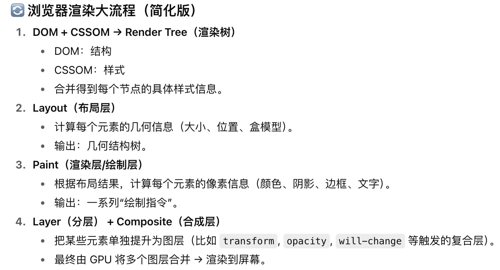

## 1. BFC
块级格式化上下文，触发条件：
- 根元素HTML
- 浮动元素 float
- position: absolute / fixed
- 弹性布局容器 display: flex / inline-flex
- 网格布局容器 display: grid / inline-grid
- overflow的值不是visible
应用场景：
- 解决外边距塌陷
- 避免父元素高度塌陷（子元素浮动后，父元素高度不再被撑开，导致父盒子高度为 0）
- 避免文字环绕浮动元素

## 2. transform为什么可以减少重排

transform绕过了布局计算，直接在合成阶段改图层显示
