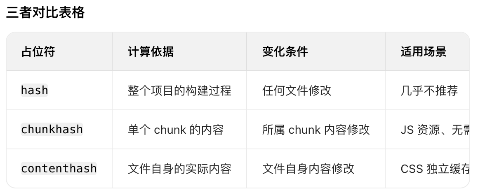
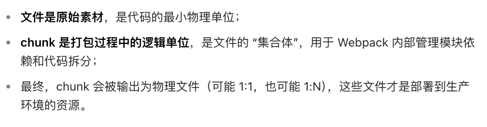

## 1. webpack 的配置有哪些
- entry：入口文件路径，可以是单个，可以是多个
- output：输出内容
    path：路径
    filename：[name][contenthash:8].js
    publicPath: 指定静态资源在浏览器中被访问时的基础路径
- resolve：配置模块解析规则
    alias：路径别名
    extension：自动解析的扩展名
- module：loader
- plugins：对打包流程的干预和增强
- externals：外部扩展
- devServer：开发服务器，配置端口、服务代理
- optimization：配置构建过程中的优化策略

## 2. 写一个webpack配置
```js
const path = require('path')
module.exports = {
    entry: path.resolve(__dirname, 'src/index.js'),
    output: {
        path: path.resolve(__dirname, 'dist'),
        filename: '[name].[contenthash:8].js',
        publicPath: './',
        clean: true
    },
    resolve: {
        alias: {
            '@': path.resolve(__dirname, 'src'),
        },
        extensions: ['.js', '.jsx']
    },
    module: {
        rules: [
            {
                test: /\.(js|jsx)$/,
                use: {
                    // 做语言转换
                    loader: 'babel-loader',
                    // 预设转换规则
                    presets: ['@babel/preset-env']
                }
            },
            {
                test: /\.(css|less)$/,
                use: {
                    loader: [
                        // 将CSS代码注入到HTML中(开发环境)，或者用 mini-css-extract-plugin 将css提取到单独的文件（生产环境）
                        'style-loader',
                        // 处理路径问题，@import url()
                        'css-loader',
                        // 将less语法转换为css
                        'less-loader',
                    ]
                },
            },
            {   
                // webpack 内置了对图片、字体等资源的处理
                test: /\.(jpg|jpeg|png|gif|svg)$/,
                type: 'asset',
                // 输出路径和文件名，默认输出到dist目录下
                generator: {
                    filename: 'static/assets/[hash][ext]'
                },
            },
        ],
    },
    plugins: [
        new HtmlWebpackPlugin()
    ],
}
```

## 3. 常见的loader
- babel-loader
- vue-loader
- ts-loader

- style-loader
- css-loader
- less-loader
- sass-loader

- url-loader
- file-loader

## 4. 常见的plugin
- html-webpack-plugin
- clean-webpack-plugin: 自动清理构建输出目录 已经可以通过 output 配置实现
- mini-css-extract-plugin: 把css单独抽成一个文件

- css-minimizer-webpack-plugin: css压缩
- terser-webpack-plugin: js压缩
- uglify-webpack-plugin: 丑化
- bundle-analyzer-webpack-plugin: 体积分析

## 5. hash contenthash chunkhash



